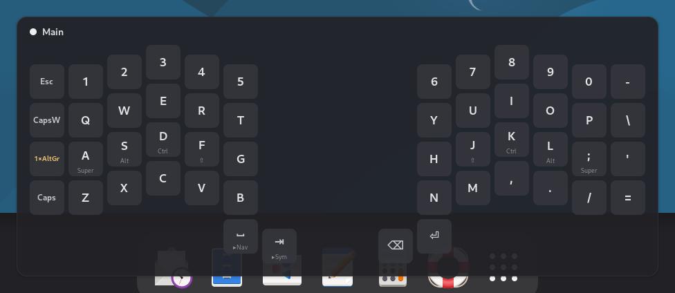
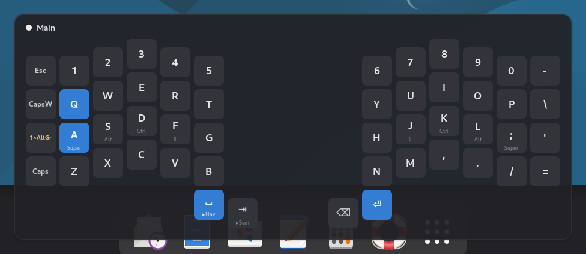
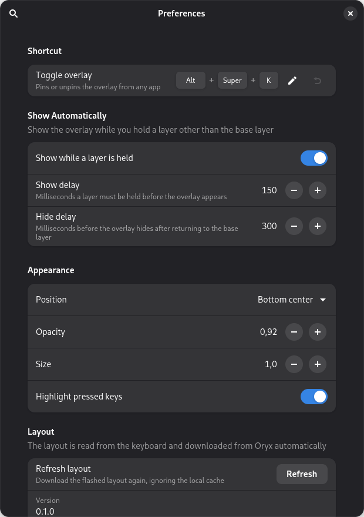

# ZSA Helper

A GNOME Shell extension that shows a floating overlay with the characters of the **active layer**
of your [ZSA Voyager](https://www.zsa.io/voyager). It is meant to help while you learn your
layers: hold a layer key, or press a shortcut, and see what every key does right now.

> **Status:** `0.1.0`, the first complete version. See the [changelog](CHANGELOG.md).



## Features

- **Live layer overlay.** Reads the active layer straight from the keyboard and draws it with the
  Voyager's real geometry. It is part of the Shell, not a window: no title bar, not in Alt+Tab or
  the overview, and it never takes focus, so you keep typing where you were.
- **Shows up when you need it.** It appears while you hold a layer key and fades out when you
  return to the base layer. `Super+Alt+K` pins it open.
- **Your real layout.** The keyboard reports which Oryx layout and revision it runs. The extension
  downloads that revision from Oryx and caches it, and after flashing a new revision it follows
  along automatically.
- **Readable keys.** Hold actions appear under the tap action (`A` / `Super`). Keys that fall
  through to the base layer are dimmed. Layer, modifier and system keys each have their own
  style, and your custom Oryx labels are kept.
- **Key highlighting.** Every key you press lights up in its physical position.



## Requirements

- GNOME Shell 48 on Wayland.
- A ZSA Voyager flashed with an [Oryx](https://configure.zsa.io) layout.
- ZSA's udev rule (`/etc/udev/rules.d/50-zsa.rules`), installed by [Keymapp](https://www.zsa.io/flash)
  or by hand. It gives your user access to the keyboard's raw HID interface; without it the
  overlay shows *"No permission to read the keyboard"*.
- Network access the first time each layout revision is used. Afterwards it is cached.
- Optional: `sqlite3`, used to read Keymapp's cache when Oryx is unreachable.
- To build from source: Node.js and pnpm.

Keymapp does not need to be running, and it keeps working normally if it is.

## Install

```bash
pnpm install
pnpm zip                          # builds build/zsa-helper@ajmasia.shell-extension.zip
pnpm run install:local --zip      # installs it for your user
```

Log out and back in (Wayland only discovers new extensions at login), then enable it:

```bash
gnome-extensions enable zsa-helper@ajmasia
```

## Usage

- **Hold a layer key:** the overlay appears after 150 ms and hides 300 ms after you return to the
  base layer. It keeps showing the layer you were looking at while it fades out.
- **`Super+Alt+K`:** pin or unpin the overlay.
- **Preferences:** `gnome-extensions prefs zsa-helper@ajmasia`, or the Extensions app.



| Setting | Default |
|---|---|
| Toggle shortcut | `Super+Alt+K` |
| Show while a layer is held | On |
| Show / hide delay | 150 ms / 300 ms |
| Position | Bottom center |
| Opacity / size | 0.92 / 1.0 |
| Highlight pressed keys | On |
| Refresh layout | Downloads the flashed revision again, ignoring the cache |

## Troubleshooting

| Message on the overlay | What to do |
|---|---|
| *Looking for your ZSA keyboard…* | Check the USB cable. The extension reconnects by itself when the keyboard appears. |
| *No permission to read the keyboard* | Install ZSA's udev rule and replug the keyboard. |
| *Layout not available* | The revision is not cached and Oryx is unreachable. Connect to the network, then use *Refresh layout*. |
| *This firmware is not an Oryx layout* | The keyboard runs firmware not built by Oryx, so there is no layout to download. |

Logs go to the journal: `journalctl --user -f -o cat /usr/bin/gnome-shell | grep zsa-helper`.

**Known limitations:**

- Key labels assume a US keyboard layout in GNOME.
- Transparent keys show the base layer; chained layers (tri-layer) are not resolved.
- Only the Voyager is supported.

## Development

```bash
pnpm build && pnpm run install:local   # symlink dist/ for development instead of a zip install
```

| Command | What it does |
|---|---|
| `pnpm build` | Compile TypeScript to `dist/` and compile the GSettings schema |
| `pnpm test` | Unit tests (Vitest) for the pure logic in `src/core/` |
| `pnpm typecheck` | Type-check the extension against the GNOME Shell 48 typings, and the tests |
| `pnpm nested` | Run a nested GNOME Shell with the extension enabled, without logging out |
| `pnpm smoke` | Headless check: the extension enables and disables cleanly and releases the keyboard |
| `pnpm nested --shots [dir]` | Capture the overlay for every layer to PNG files |
| `pnpm probe:device` | Print live events from the keyboard (layers, key presses, firmware) |
| `pnpm probe:layout <layout> <revision>` | Load a layout revision and report its source (`--clear`, `--offline`, `--refresh`) |
| `pnpm probe:prefs [dir]` | Open the preferences with in-memory settings and capture them to PNG files |
| `pnpm zip` | Pack the extension, without development files, into `build/` |

- The nested shell uses its own dconf database (`~/.config/dconf/zsa_helper_nested`) and loads
  the extension from `dist/`. Enabling it there never changes your real session, whatever version
  you have installed.
- Set `ZSA_HELPER_DEBUG=1` (for example `ZSA_HELPER_DEBUG=1 pnpm nested`) to log how long each
  layer change takes to reach the screen.

### Layout of the code

| Path | Contents |
|---|---|
| `src/core/` | Pure TypeScript, with no GNOME imports: Oryx protocol, layout model, labels, geometry, visibility rules |
| `src/device/` | Raw HID discovery and the keyboard connection (Gio) |
| `src/layout/` | Oryx API client, disk cache and Keymapp fallback |
| `src/ui/` | The overlay (St) |
| `src/prefs/` | Preferences window (Adw) |
| `src/dev/` | Development probes and the screenshot hook; not packaged |

## License

[GPL-3.0-or-later](LICENSE)
